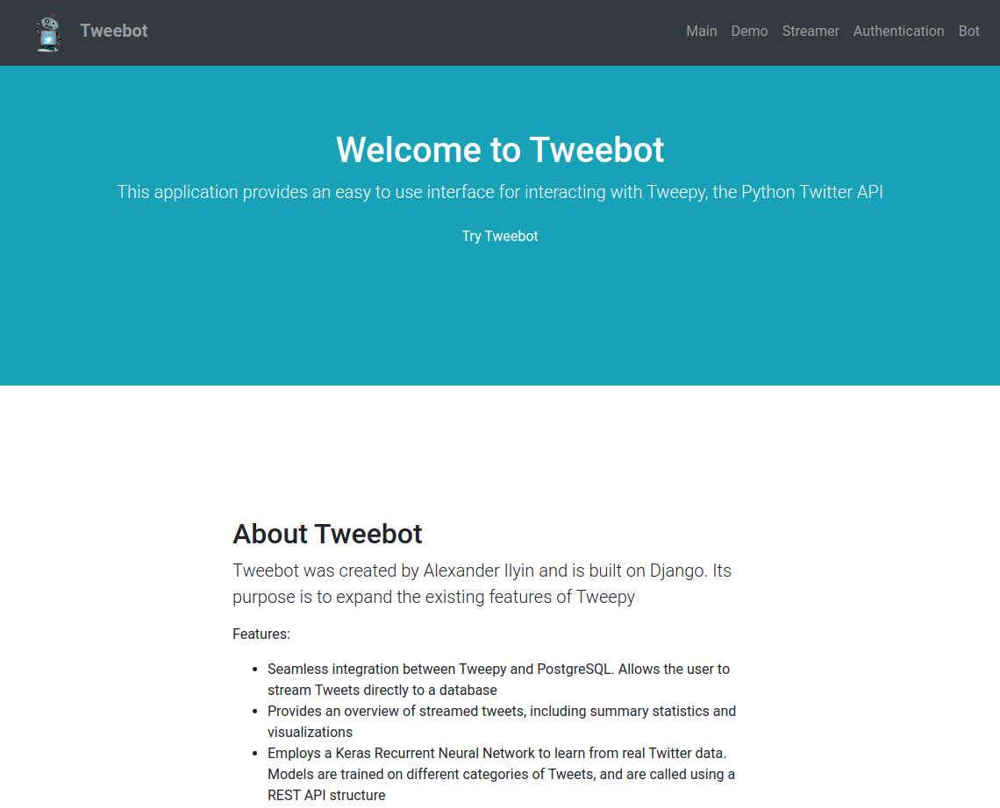
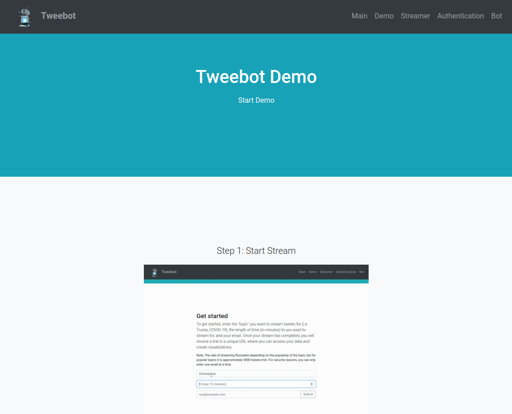
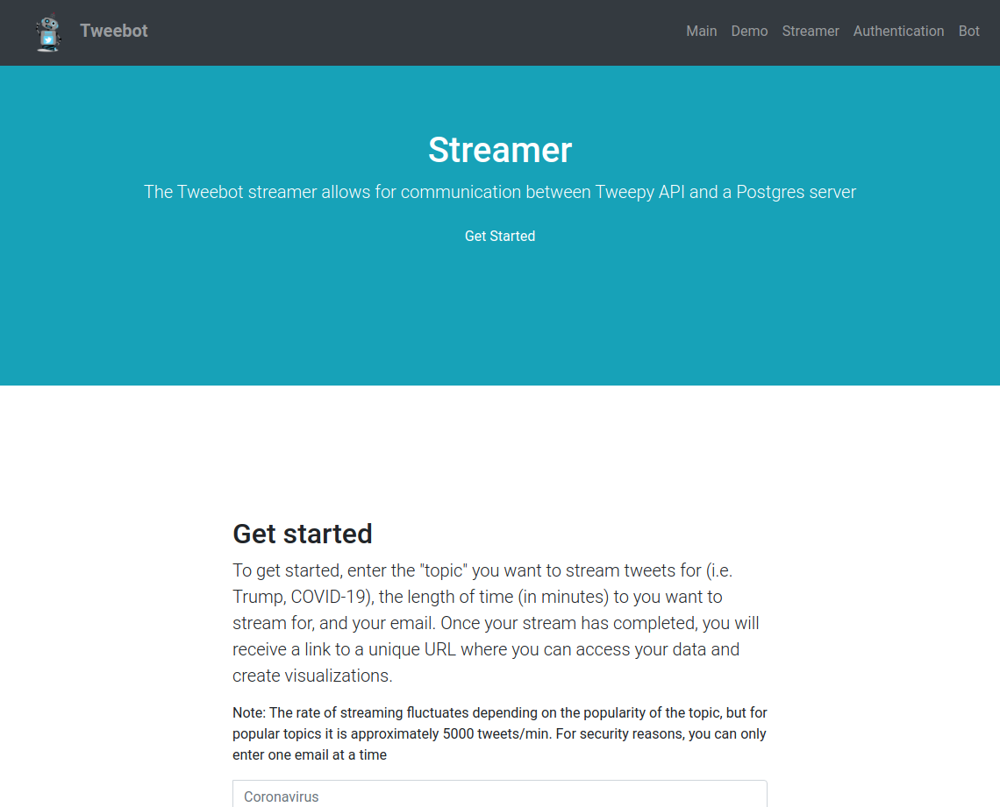
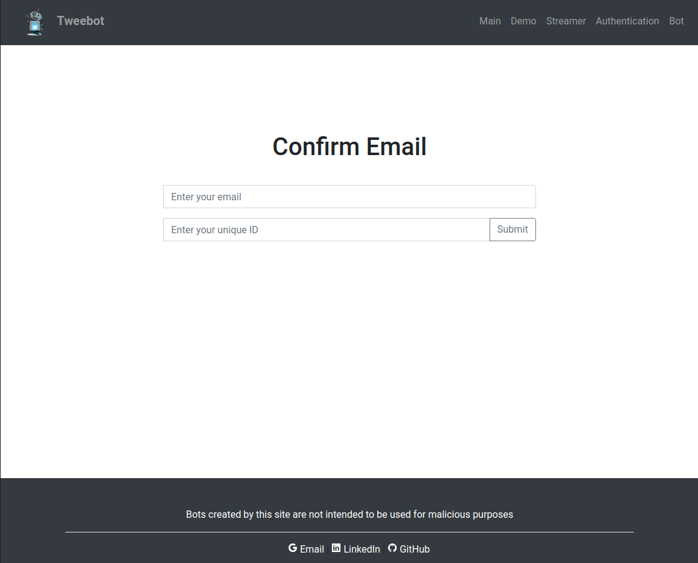

# Tweebot
An extension of the Tweepy Twitter API library

## Introduction

This tool was created in order to provide a data collection tool for people wishing to begin a data science project related to NLP. One of the main challenges in starting such a project is finding data. While there is tons of data available online, its hard to decide on a source of data and even harder to decide on a medium for data collection. In terms of data availability, Twitter provides a great API for data collection, but even with the abundance of API wrappers available, its not always hard to get started with streaming data from Twitter. Tweebot aims to provide a 1-click solution to this issue (literally).  

## Features 

* Live stream tweets to a backend PostgreSQL database
* Download those tweets to a CSV
* View exploratory data analysis of your tweets
* See the most popular tweets in your dataset
* Maintain your account and reuse it, or delete it and start over
* Create a chatbot/Twitter bot from the tweets you collected <- feature in progress

## How it works

The main issue with such a tool is dealing with the time needed to stream a decent number of tweets. If a person wants to complete a NLP project that will provide actionable results, its not unreasonable to assume that the dataset they will require will need millions of rows of data, especially with something like tweets that contain trace amounts of text data. Creating a website that streams tweets real time and leaves the user at a loading page waiting for their tweets to show up is simply not realistic - leaving a page hanging for an extended amount of time will cause it to time out. 

For this reason, I used Celery task scheduling to run tweet streaming as an asynchronous task - when a user requests tweets, Celery processes each request as a task to be completed in the backend. Using Redis as a messaging queue/storage for Celery tasks, each task is processed and tweets are streamed. Those tweets are streamed directly from Twitter using the Twitter API/Tweepy to a backend PostgreSQL database. Once the task has been finished, the user receives an email with a unique UUID code that they can use to login. Once they login they are presented with their own personalized dashboard. 

## Screenshots 

Home Page 

Demo Page

Streamer Page

After Streaming Authentication

## Demo Gifs

Streaming

Logging in

Dashboard

